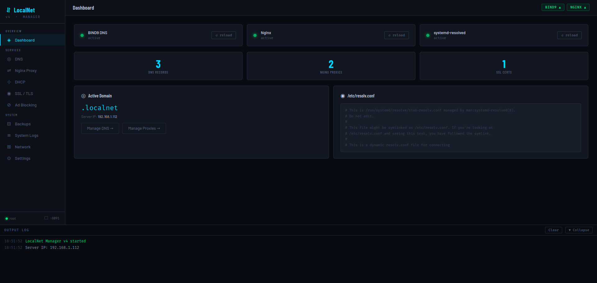
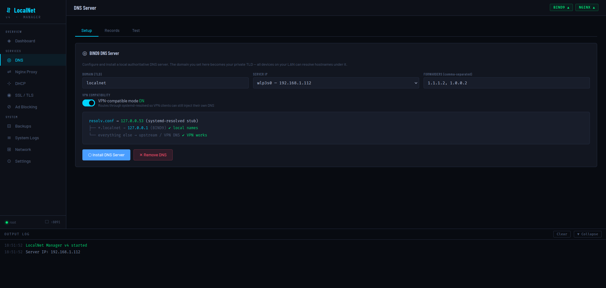
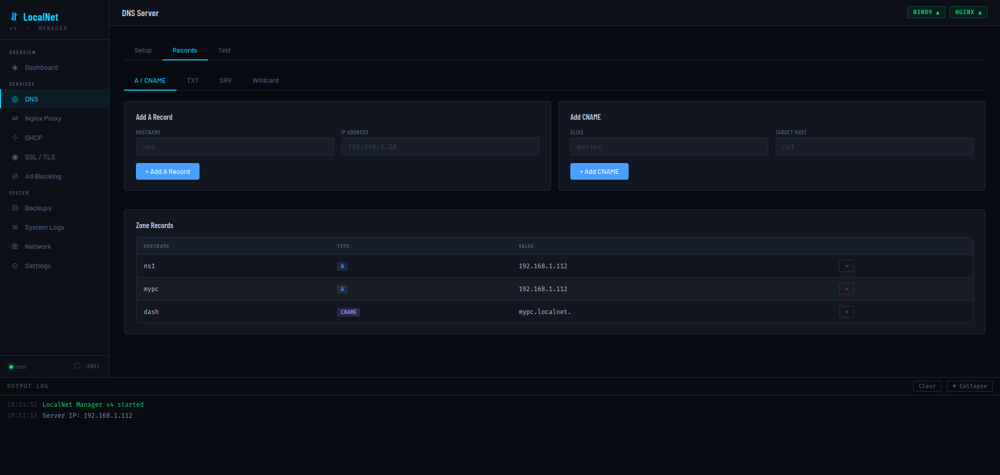
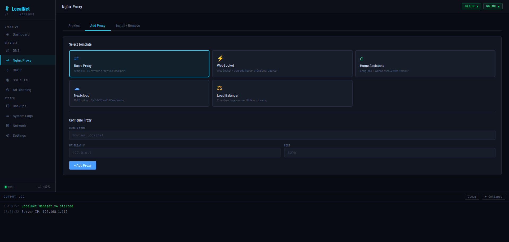
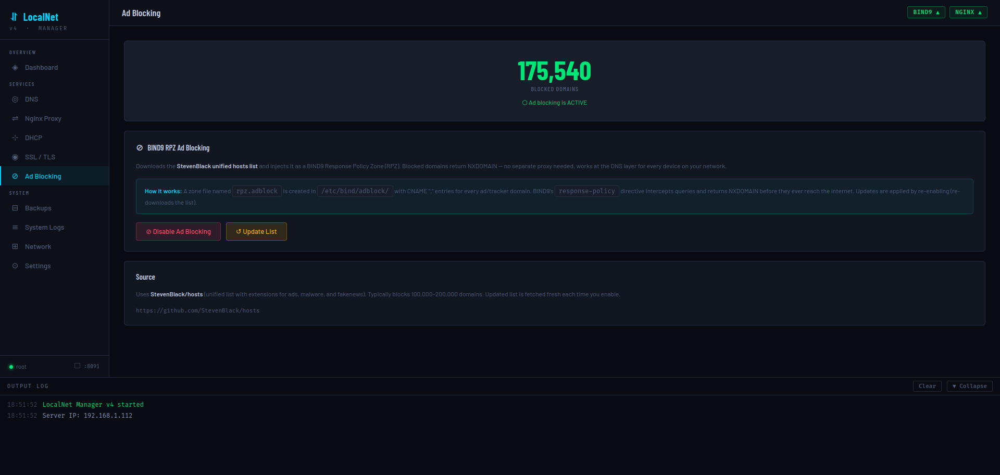
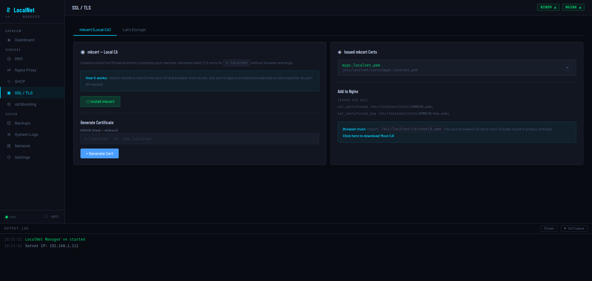
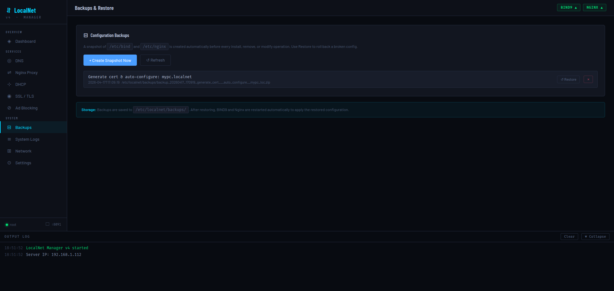

> [!NOTE]
> **v4_alpha_c Update: The Device Manager**
>
> This update introduces a dedicated **Device Manager** tab to the DNS section for automated network control and visibility.
>
> * **Auto-Discovery:** Automatically detects devices on your network via BIND9 query logs.
> * **Quick Registration:** Map local IPs to hostnames (e.g., `mypc2.localnet`) with one click.
> * **Access Control:** Directly **Block** or **Unblock** devices from DNS resolution using a managed ACL system.
> * **Device Cleanup:** Remove stale or "unlabeled" entries from the local database.

>
> Alpha C2 & C3 Updates:
> 2 -
> 3 - 

<div align="center">

<br>

```
⬡  LocalNet Manager
```

# LocalNet Manager v4

**A single-file, self-hosted web control panel for your private LAN.**
DNS · Reverse Proxy · DHCP · SSL/TLS · Ad Blocking · Backups — all from your browser.

So, I let AI write the Docs/Readme. I'm slowly looking through it...as it should be good, if you find anything invalid let me know!

<br>

[](https://python.org)
[](https://flask.palletsprojects.com)
[](https://www.isc.org/bind/)
[](https://nginx.org)
[](LICENSE)
[]()

<br>

**[📖 Full Documentation →](https://partakithware.github.io/LocalNet/?ver=5)**

<br>



</div>

---

## What is it?

LocalNet Manager turns any Linux machine into a fully managed home or office network server. Instead of manually editing zone files, writing Nginx configs by hand, or remembering `certbot` flags — everything is a button click in a browser UI running on port **8091**.

It ships as a **single Python file**. No Docker, no complex setup. Run it with `sudo`, open your browser, and your network is under control in minutes.

---

## Features

| | Feature | Description |
|---|---|---|
| 🌐 | **BIND9 DNS Server** | Private TLD with A, CNAME, TXT, SRV, and wildcard records |
| ↔️ | **Nginx Reverse Proxy** | 5 built-in templates: Basic, WebSocket, Home Assistant, Nextcloud, Load Balancer |
| 📡 | **DHCP Server** | ISC-DHCP with range, gateway, lease time, and DNS injection |
| 🔒 | **SSL / TLS** | Local CA via `mkcert` + globally trusted Let's Encrypt via DNS-01 (no port 80 needed) |
| 🚫 | **Network Ad Blocking** | BIND9 RPZ powered by the StevenBlack hosts list — 100k–200k domains blocked network-wide |
| 💾 | **Automatic Backups** | ZIP snapshots of `/etc/bind` and `/etc/nginx` before every operation, one-click restore |
| 📜 | **Live System Logs** | Real-time `journalctl` stream for BIND9, Nginx, DHCP, and systemd-resolved |
| 🔌 | **VPN Compatible** | Routes through `systemd-resolved` so VPN clients can still inject their own DNS |
| 🔐 | **Authentication** | Session-based login with SHA-256 hashed passwords |

---

## Screenshots

<table>
<tr>
<td><br><sub><b>DNS Server Setup</b></sub></td>
<td><br><sub><b>DNS Records</b></sub></td>
</tr>
<tr>
<td><br><sub><b>Nginx Proxy Templates</b></sub></td>
<td><br><sub><b>Ad Blocking (175k+ domains)</b></sub></td>
</tr>
<tr>
<td><br><sub><b>SSL / TLS — mkcert Local CA</b></sub></td>
<td><br><sub><b>Backups & Restore</b></sub></td>
</tr>
</table>

---

## Quick Start

**Requirements:** Ubuntu 22.04+ or Debian 12+, Python 3.10+, must run as root.

```bash
# 1. Install Flask
pip3 install flask

# 2. Run
sudo python3 localnet_v4_alpha_b.py
```

Then open **`http://<your-server-ip>:8091`** in your browser.

> **Default password:** `localnet` — change it immediately in Settings.

---

## First-Time Setup

Once logged in, the recommended order is:

1. **Settings** → Change your password
2. **Network** → Confirm your server IP is detected correctly
3. **DNS → Setup** → Install BIND9 with your chosen TLD (default: `.localnet`)
4. **DNS → Records** → Add an A record for your server (`ns1`, `mypc`, etc.)
5. **Nginx Proxy → Install / Remove** → Install Nginx
6. **Nginx Proxy → Add Proxy** → Add your first reverse proxy
7. **SSL / TLS** → Install `mkcert` and generate a cert for your domain

---

## Run as a systemd Service

```ini
# /etc/systemd/system/localnet.service
[Unit]
Description=LocalNet Manager v4
After=network.target

[Service]
ExecStart=/usr/bin/python3 /path/to/localnet_v4_alpha_b.py
Restart=on-failure
User=root

[Install]
WantedBy=multi-user.target
```

```bash
sudo systemctl daemon-reload
sudo systemctl enable --now localnet
```

---

## How It Works

```
Browser (port 8091)
  └── Flask REST API + SSE log stream
        └── Bash scripts via subprocess (run as root, async in daemon threads)
              ├── BIND9      →  /etc/bind/
              ├── Nginx      →  /etc/nginx/sites-{available,enabled}/
              ├── ISC-DHCP   →  /etc/dhcp/dhcpd.conf
              ├── mkcert     →  /etc/localnet/certs/
              └── systemd-resolved  →  /etc/systemd/resolved.conf.d/
```

Every destructive operation automatically creates a ZIP backup of `/etc/bind` and `/etc/nginx` before executing. All real state lives in system config files — the app itself is stateless.

**DNS resolution chain (VPN-compatible mode):**
```
resolv.conf → 127.0.0.53 (systemd-resolved stub)
   ├── *.localnet  →  127.0.0.1 (BIND9)   ✔ local names
   └── everything else  →  upstream / VPN DNS  ✔ VPN works
```

---

## Nginx Proxy Templates

| Template | Best for |
|---|---|
| **Basic** | Any standard HTTP service |
| **WebSocket** | Grafana, Jupyter, code-server |
| **Home Assistant** | Home Assistant with long-poll + WebSocket |
| **Nextcloud** | Large file uploads (10GB), CalDAV/CardDAV redirects |
| **Load Balancer** | Round-robin across multiple upstream servers |

---

## Ad Blocking

LocalNet's ad blocking works at the DNS layer — no browser extension or separate proxy needed. It uses BIND9's **Response Policy Zone (RPZ)** feature with the [StevenBlack unified hosts list](https://github.com/StevenBlack/hosts). Blocked domains return `NXDOMAIN` instantly to **every device on your network**.


---

## SSL / TLS Options

### Option A — mkcert (Local CA)
Best for: pure local networks, no public domain required.
- Generates a local CA trusted by your machine
- Issues `*.localnet` certs with no port 80 or internet access needed
- Other devices trust the certs by importing the Root CA once

### Option B — Let's Encrypt (DNS-01)
Best for: publicly registered domains, globally browser-trusted certs.
- Uses Certbot with the DNS-RFC2136 plugin
- Writes a temporary TXT record to your BIND9 zone to prove ownership
- **No port 80, no public IP required**
- Requires a real, publicly resolvable domain you own

---

## Dependencies

| Dependency | Type | Notes |
|---|---|---|
| `flask` | pip | Only external Python dependency |
| `bind9 bind9utils dnsutils` | apt | Installed on demand via DNS Setup |
| `nginx` | apt | Installed on demand via Nginx page |
| `isc-dhcp-server` | apt | Installed on demand via DHCP page |
| `mkcert` | binary | Downloaded from GitHub releases |
| `certbot python3-certbot-dns-rfc2136` | apt | Installed on demand via SSL page |

All standard library modules (`sqlite3`, `subprocess`, `threading`, `zipfile`, etc.) — no additional installs.

---

## Security

> ⚠️ **Designed for trusted LAN use only.** Do not expose port 8091 to the internet.

- Passwords stored as SHA-256 hash in `/etc/localnet/config.json`
- Password comparison uses `hmac.compare_digest()` (timing-safe)
- Flask session secret auto-generated with `secrets.token_hex(32)` and persisted across restarts
- All API routes (except `/login`) require an active session — unauthenticated requests return HTTP 401

---

## File Layout

```
/etc/localnet/
├── config.json          # App configuration & password hash
├── localnet.db          # SQLite: notes, backup history
├── certs/               # mkcert-issued certificates
├── ca/                  # mkcert local CA root
├── backups/             # ZIP snapshots (auto + manual)
└── certbot/             # Certbot TSIG key & rfc2136.ini
```

---

## 📖 Documentation

Full API reference, UI guide, architecture diagrams, troubleshooting, and more:

### **[partakithware.github.io/LocalNet/?ver=5](https://partakithware.github.io/LocalNet/?ver=5)**

---

## Contributing

Issues and pull requests are welcome. This is an alpha release — expect rough edges.

1. Fork the repo
2. Make your changes to `localnet_v4_alpha_b.py`
3. Test with `sudo python3 localnet_v4_alpha_b.py`
4. Open a PR describing what changed and why

---

<div align="center">
<sub>Built for self-hosters who want their home network to just work.</sub>
</div>
